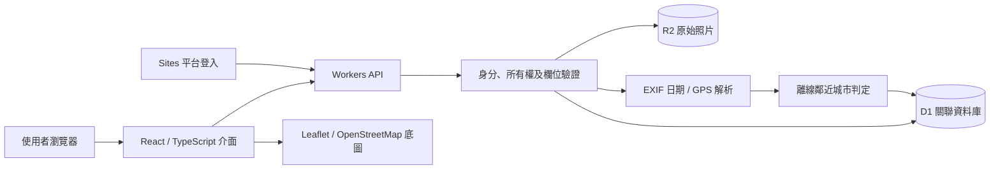
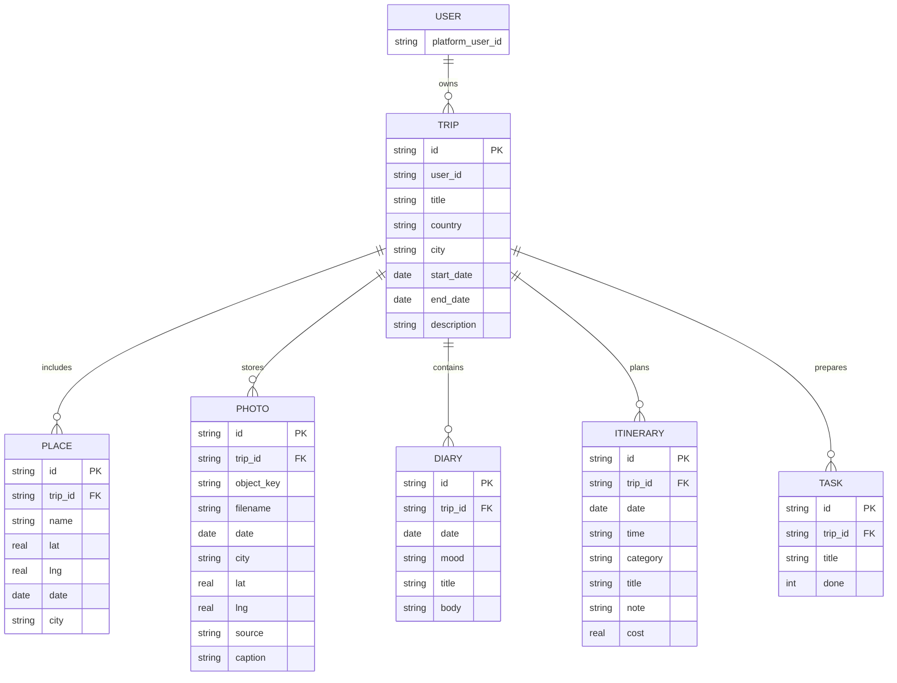

# Travel Memory：互動式旅遊規劃與足跡紀錄系統
版本：可展示實作版｜日期：2026-09-19

## 摘要
本專題以「旅行前的期待、旅行中的紀錄、旅行後的回憶」為主軸，設計一套個人旅行網站。使用者可以建立旅行、安排每日行程，在世界地圖上標記曾到訪的位置，保存原始照片與心情日記。系統以照片 EXIF 拍攝日期與 GPS 資訊輔助相簿分類，並保留手動修正機制。後端使用關聯式資料庫管理旅行與紀錄，物件儲存保存照片，登入身分作為資料存取的權限依據。本次實作完成核心功能並通過本機自動測試；研究成效與使用者滿意度尚未進行實證調查。

## 一、研究動機與問題
旅行資訊常分散在相簿、記事本與地圖應用中，規劃與回憶之間缺少連結。對期待寒暑假旅行的學生而言，規劃過程本身能提供具體的期待感。因此，本專題將倒數與準備清單加入旅行管理，使未來旅行與既有回憶共存在同一個個人空間。

要處理的問題為：如何以旅行為單位整合資訊；如何以地圖回顧到訪位置；如何減少照片整理負擔；如何在照片資訊不足時避免錯誤分類；如何避免不同帳號讀取彼此的紀錄。

## 二、範圍與需求
| 編號 | 需求 | 實作結果 |
|---|---|---|
| F01 | 登入並擁有私人資料 | 平台登入、穩定 user ID、每次 API 驗證所有權 |
| F02 | 管理旅行與日期 | 新增／修改／刪除，阻擋不合理日期 |
| F03 | 世界足跡 | Leaflet 互動地圖、座標選取、打卡列表 |
| F04 | 原始照片保存 | R2 保存 bytes，D1 保存分類與擁有者關係 |
| F05 | 照片分類 | EXIF 日期與 GPS 鄰近城市、手動更正 |
| F06 | 心情紀錄 | 日期、心情、標題、日記內文 |
| F07 | 下一趟規劃 | 每日行程、時間、類型、備忘、預算 |
| F08 | 出發期待 | 倒數、準備清單、完成百分比 |
| F09 | 統計與查找 | 國家／地區、城市、旅行天數、照片數、搜尋 |
| F10 | 展示與匯出 | 明確標示的示範旅行、JSON 文字匯出 |

非功能需求：繁體中文、響應式版面、鍵盤表單操作、失敗時保留輸入、參數驗證、所有權檢查、照片大小限制。此版本未加入社群公開分享、訂房交易、AI 景點辨識或完整離線地圖。

## 三、使用案例
使用者登入後建立旅行。旅行前，新增交通、住宿、景點與待辦；旅行中，在地圖打卡、上傳照片並記錄心情；旅行結束後，透過城市及日期重看相簿與日記。若 EXIF 缺失，使用者可手動修正分類；若編輯旅行日期會排除既有行程／打卡／日記，系統拒絕修改並說明原因。

## 四、系統架構

前端以單一工作空間切換世界地圖、旅行、相簿與日記，減少不必要的頁面跳轉。前端呈現的資料來自後端，瀏覽器儲存不作為權威資料來源。使用者登入由平台處理，應用不儲存密碼。

## 五、資料庫設計

USER 是平台身分概念，沒有另外建立密碼資料表。TRIP.user_id 對應平台 ID。其餘五張表以 trip_id 關聯旅行，使用 ON DELETE CASCADE；查詢常用欄位 user_id 與 trip_id 建立索引。所有 SQL 值透過 prepared statement 綁定；表名及欄位名僅由伺服器的固定白名單產生。

照片不直接放在資料庫，避免大二進位內容影響一般查詢。photos.object_key 指向 R2，照片讀取端點必須先透過旅行關聯確認所有權。刪除旅行前先處理對應物件，再刪除資料列。D1 與 R2 沒有跨服務交易，極端故障仍可能造成資料列與物件短暫不一致，正式服務需加入補償工作或清理佇列。

## 六、API
| 方法／路徑 | 功能 | 主要驗證 |
|---|---|---|
| GET /api/data | 查詢自己的所有旅行資料 | 登入、user_id 篩選 |
| POST /api/actions | 新增／修改／刪除旅行與子紀錄 | Origin、Zod、所有權、日期 |
| POST /api/photos | 單張 multipart 照片上傳 | 登入、旅行所有權、12 MB、檔案簽章 |
| GET /api/photos/:id | 讀取原始照片 | 登入、跨表所有權查詢 |

回應以 JSON 傳送。401 表示未登入，403 表示來源不允許，404 表示不存在或不屬於目前使用者，400 表示資料格式不符，503 表示儲存服務不可用。照片 API 以原始影像內容回傳，設定 private/no-store 與 nosniff。

## 七、照片分類演算法
1. 接收 JPEG／PNG／WebP，檢查檔案大小及簽章。
2. 使用 exifr 讀取 DateTimeOriginal，缺少時嘗試 CreateDate。
3. 讀取 GPS，驗證緯度與經度數值範圍。
4. 使用 Haversine 大圓距離比較離線城市中心點。
5. 若最近城市距離小於 50 公里，建議該城市並顯示約略距離；否則標為待確認地點。
6. 缺少 GPS 時採用旅行城市，缺少拍攝時間時採用使用者選定日期／旅行開始日，並標示來源。
7. 保存原始照片與分類結果；使用者可修改城市、日期、照片說明。

大圓距離 d = 2R atan2(√a, √(1−a))，其中 a = sin²(Δφ/2) + cosφ₁ cosφ₂ sin²(Δλ/2)，R = 6371 公里。以 C 個城市、P 張照片而言，分類為 O(P×C)；目前城市表規模小，不需要空間索引。未來可使用地理資料庫、R-tree 或受控的 reverse geocoding 服務。

這不是影像內容辨識，不會看圖猜景點；離線城市中心點只是近似。鄰近城市、海島與郊區可能需要人工確認。含 GPS 的照片不會把精確座標送去第三方地理反查服務；地圖瀏覽本身仍向 OpenStreetMap 請求底圖。

## 八、日期與統計
旅行狀態使用 Asia/Taipei 的當日曆日期：出發前為即將出發，出發日到回程日為旅行中，回程後為回憶收藏。倒數以日曆日期差計算，不以當地午夜的毫秒差直接除以 24 小時，降低日光節約時間影響。

旅行天數以已經到來的日期聯集計算，重疊旅行不重複計入同一天。國家／城市統計以日期不晚於今日的打卡紀錄去重。未來旅行或未來打卡不算已到訪。名稱採使用者輸入字串，目前未完成世界國家名稱標準化，例如「日本」與「Japan」會被視為不同分類。

## 九、測試方法與結果
本機 Node.js、D1／R2 模擬環境執行；結果不是正式雲端負載或使用者研究。
- 8 項 domain tests：合法閏日、非法日期、跨 DST 日數、旅程狀態邊界、重疊天數去重、排除未來足跡、GPS 距離、旅行長度。
- 23 項 API integration checks：登入限制、旅行增改、日記增改、行程與預算、待辦狀態、檔案上傳讀回、偽裝檔拒絕、手動分類、跨來源拒絕、關聯刪除。
- 2 項 EXIF checks：建立可解析的 JPEG 測試樣本；透過 API 驗證拍攝日期與東京 GPS 覆蓋旅行預設的大阪分類。
- 瀏覽器手動驗證：首頁／地圖、載入示範、建立旅行、上傳 EXIF 照片、相簿分類與手機寬度檢查。
- WebMCP：讀取旅行與開啟新增表單可用，額外欄位輸入遭拒絕，不會新增資料。

本次未做正式多帳號平台登入端到端測試、壓力測試、可用性研究與使用者訪談。所有權過濾已實作，但不可把程式檢查等同於完整滲透測試。

## 十、限制與後續工作
目前離線城市表約 50 筆，未覆盖全球城市；照片不自動建立地圖打卡，避免把推測位置當成真實到訪；沒有 HEIC 直接上傳與縮圖／分頁，超大型相簿效能有待改善。原始照片保留 EXIF，下載仍可能含定位資訊。旅程資料全量載入適合專題規模，正式服務需逐步改為分頁與服務端搜尋。

後續可進行：世界城市標準化、使用者確認後把 GPS 建議轉成足跡、縮圖產生與背景處理、多帳號測試、完整備份還原、跨服務刪除補償、可用性訪談。AI 圖像標籤仍屬延伸題，未冒充已完成功能。

## 十一、開發與學習分工
本專題依使用者提出的產品概念完成程式實作，程式有 AI 工具協助。正式提交時應依學校規範揭露工具使用方式；使用者須能說明需求、架構、資料流、演算法與限制。學校封面、組員姓名、指導老師、章節格式、文獻格式與實際研究資料需依真實資訊補齊。

